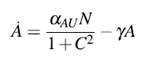
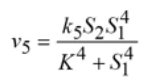

# 定量生理学 - 复习笔记


## 一、基本概念

#### 1. 定量生理学的定义：

> Physiology is the study of nature of life. The rapid advances of  technology have revolutionized the research of physiology in the era of Big Data.
>
> Quantitative Physiology is the modeling and computational study of Physiology, which is an increasingly important branch of systems biology. It will take the power of physics, mathematics, information technology, etc., to implement quantitative, testable and predictable research on physiology.

生理学是对生命本质的研究。~~在大数据时代，科学技术的飞速发展使生理学研究发生了革命性的变化。~~

定量生理学是生理学的建模和计算研究，是系统生物学的一个日益重要的分支。定量生理学利用物理学、数学、信息技术等学科的力量，对生理学进行定量、可测、可预测的研究。


#### 2. 定量生理学ABC结构：

> + **Applied methods** 
>   + System and model
>   + Modelling process
>   + Resources and tools
> + **Basic case studies**
>   + Gene expression
>   + Bone mechanics
>   + Blood dynamics
>   + Neural activity
> + **Complex applications**
>   + Cortical spreading depression
>   + Heart physiome
>   + Brain project

应用方法 ( 系统与建模、建模过程、资源和工具 )；

基础案例研究 ( 基因表达、骨力学、血液动力学、神经活动 )；

复杂应用 ( 皮层扩散抑制、心脏生理学、脑力工程 )。


#### 3. 科学模型的四种形式

+ 物理模型

  > 描述：物体的物理表示。`eg`：DNA双螺旋模型

+ 概念模型

  > 描述：系统的自然语言描述。`eg`：内部环境

+ 图解模型

  > 描述：对象和进程的图形显示。`eg`：钙诱导钙释放的途径

+ 数学模型

  > 描述：基于代数或微分方程的模型。`eg`：`BMI = mass ( kg ) / ( height ( m ) ^ 2 )`


#### 4. 心脏有关知识

心动周期：心脏静息 --> 窦房结开放 --> 房室结开放 --> 心室完全收缩 --> 心室舒张 --> 心脏静息


x 轴：左心室容积；y 轴：以左心室血压为量度；B：`EDV`舒张末期容积；D：`ESV`收缩末期容积；

Stroke Volume 每搏输出量：`SV` = `EDV` - `ESV` ，心脏一次往外输出的血量。

Cardiac output 心输出量：`CO` = `HR` × `SV`  ( HR:心率 ) ≈ 5 L/min。人体血量约 5 L。

Ejection Fraction 射血分数：`EF` = `SV` / `EDV` . 正常值：> 60% .


## 二、具体模型

#### 人类知识量模型

> 模型假设：
>
> A person's knowledge is a balance of learning and forgetting. If the rate of learning increases linearly with the square root of age and the rate of forgetting increases proportionally with the square of age.
>
> 一个人的知识量是学习和遗忘的平衡。假设学习率与年龄平方根成正比，遗忘率与年龄平方成正比。


参数含义：K, 知识总量；y, 年龄；a, 知识增长率；b, 知识遗忘率。

*当给出知识储量峰值在64岁时，可以算出 a, b 的关系，从而算出在一年内能获取知识量的最大值。*


#### 粒子模型 - 随机行走中的单个生物分子

> 用于描述由一系列随机步骤组成的路径。是布朗运动的理想数学状态。
>
> + **一维随机行走**：
>
>   模型假设——the random walk is set on the integer number line, which starts at 0 and each step moves +1 ( forward ) or -1 ( backward ) with equal probability.
>
>   随机游动设置在整数行上，整数行从0开始，每一步以相等的概率向前或向后移动+1（向前）或-1（向后）。

则，n步后，m步正向的概率：

行走的路程可表示为：`S = m - ( n - m ) = 2m - n` .

利用 n! ≈ (n/e)<sup>n</sup> 做近似代换，有：

计算 S 的期望和 S<sup>2</sup> 的期望：


若，模仿 P(S) 创造溶液中某物质浓度的函数 C(x, t) ：

有：

这样，我们就得到了**菲克第二定律**。接着可以算出 x 的期望：


又因为扩散系数 ` D = kT / α `.

k 为玻尔兹曼常数；T 是绝对温度；

`α` 为溶液中的粘性摩擦，对球形粒子有：`α = 6Πμr `. μ 是溶液粘度，r 是粒子半径。


#### 质量作用定律

对于化学反应            有反应方程式：

那么对于可逆反应：   有 ODE 等式：

反应平衡状态时，  解得：

> 🌰：
>
> 初始值：A -> 10, B -> 20, C -> 0, D -> 0; 反应速率常数：`k1 = 4, k2 = 2, k3 = 1` .
>
> 
>
> 故，可以得到ODE等式：
>
> ```js
> d[A] / dt = -k1[A]
> d[B] / dt = k1[A] - k2[B] + k3[C]*k3[D]
> d[C] / dt = k2[B] - k3[C]*[D]
> d[D] / dt = k2[B] - k3[D]*[C]
> 
> 
> //matlab代码：
> //mass.m文件
> function dxdt=mass(t,x)
> dxdt = zeros(4,1);
> dxdt(1) = -4*x(1);
> dxdt(2) = 4*x(1) - 2*x(2) + 1*x(3)*x(4);
> dxdt(3) = 2*x(2) - x(3)*x(4);
> dxdt(4) = 2*x(2) - x(3)*x(4);
> end
> //命令行窗口
> >>[t,x] = ode45('mass',[0,2.5],[10,20,0,0]);
> plot(t,x(:,1),'r','LineWidth',1.5);
> hold on;
> plot(t,x(:,2),'b','LineWidth',1.5);
> hold on;
> plot(t,x(:,3),'y','LineWidth',1.5);
> hold on;
> plot(t,x(:,4),'g','LineWidth',1.5);
> legend('A','B','C','D');
> xlabel('Times(s)');
> ylabel('Concentration');
> ```
>
> 


#### 有限状态自动机 - 元胞自动机

> 将研究对象划分成一个个单元，每个单元的状态受到周围单元的刺激，并且和自己的状态有关。


#### Hodgkin & Huxley模型 ( 动作电位模型 )

原作文献：[A QUANTITATIVE DESCRIPTION OF MEMBRANE CURRENT AND ITS APPLICATION TO CONDUCTION AND EXCITATION IN NERVE (BY A. L. HODGKIN AND A. F. HUXLEY)](./ref/HH_model_jphysiol.1952.sp004764.pdf)

意义：

+ 首次创建动作电位产生和传播的数学模型

+ 生理学领域最重要的数学模型

+ 离子通道的门控机制得到证实

模型描述：

将神经元抽象成电路，动作电流由4部分构成： 

钾离子门控通道 g<sub>k</sub> = 36 n<sup>4</sup>   ,  漏电流通道 g<sub>L</sub> = 0.3 

钠离子门控通道 ( 3个“m”门控，1个“h”门控 )   -->   g<sub>Na</sub> = 120 m<sup>3</sup> h 

模型构建：

C<sub>m</sub> d V / d t = [ -36 n<sup>4</sup> ( V - V<sub>K </sub>) - 120 m<sup>3</sup> h (V-V<sub>Na</sub>) - 0.3( V - V<sub>L </sub>)]
d m / d t = α<sub>m</sub> (V<sub>m</sub>) ( 1 - m ) - β<sub>m</sub> (V<sub>m</sub>) m
d n / d t = α<sub>n</sub> (V<sub>m</sub>) ( 1 - n ) - β<sub>n</sub> (V<sub>m</sub>) n
d h / d t = α<sub>h</sub> (V<sub>m</sub>) ( 1 - h ) - β<sub>h</sub> (V<sub>m</sub>) h

 


`FitzHugh-Nagumo model`

> 该模型是对 Hodgkin-Huxley model 的简化，将4维简化到了二维。

在Hodgkin & Huxley模型中用 v 代替膜电位 V；用 w 代替离子门控通道 m, n, h；得到：


 

+ 稳定点分析：


曲线是由 d v / d t = 0 得到的 w = f(v)；直线是由 d w / d t = 0 得到的 w = b v / γ .

 


#### 基因表达模型

##### 模型背景：

基因表达中心法则：


转录调控：

`transcriptional factors( TF, 转录因子 )`

+ 激活子调控机制：

  

+ 抑制子调控机制：

  


##### 模型构建：

> 模型假设：大多数转录因子以二聚体的形式与启动子结合，我们采用化学反应的方式，按照质量作用定律建立模型。
>
> 参数变量：P 为转录因子单体，P<sub>2</sub> 为二聚体，O<sub>u</sub> 为未结合转录因子的启动子，O<sub>b</sub> 为结合了转录因子的启动子，k 为化学反应速率常数。
>
> 

考虑反应平衡状态：k<sub>d</sub> P<sup>2</sup> = k<sub>-d</sub> P<sub>2</sub> ,    k<sub>b</sub> O<sub>u</sub> P<sub>2</sub> = k<sub>-b</sub> O<sub>b</sub>   =>   k<sub>b</sub> O<sub>u</sub> (k<sub>d</sub> / k<sub>-d</sub>) P<sup>2</sup>= k<sub>-b</sub> O<sub>b</sub> . 

又因为 O<sub>u</sub> + O<sub>b</sub> = N (总基因分子)，可以得到：

其中， ( 这样我们得到了**希尔方程** )

基因表达速率：( `α` 是转录因子工作系数，表达速率由已结合和未结合的基因共同决定 )


*图1. 转录因子为抑制子时基因表达的曲线                                                   图2. 转录因子为激活子时基因表达的曲线*


基因表达速率即蛋白质浓度的导数，于是可以得到蛋白质浓度 X 的表达式，这里考虑蛋白质降解 r<sub>deg</sub>(X) : 


如果进一步考虑到 `mRNA` 的动力学因素，则：(m为 `mRNA` 浓度，r<sub>trl</sub>为翻译速率)


#### 基因调控网络


基因A 表达 A蛋白 (通过聚合体A<sub>3</sub>) 激活基因B 表达 B蛋白 (通过聚合体B<sub>4</sub>) 激活基因C 表达 C蛋白 (通过聚合体B<sub>2</sub>) 抑制基因A 和 基因B。


+ A有两种状态：

  + 未结合 O<sub>AU</sub>
  + 与 C<sub>2</sub> 结合 O<sub>AC</sub>

      =>       O<sub>AU</sub> C<sup>2</sup> = O<sub>AC</sub> &  O<sub>AU</sub> + O<sub>AC</sub> = N   

  =>   A = α<sub>AU</sub> O<sub>AU</sub> + α<sub>AC</sub> O<sub>AC</sub> - γ A . 规定 α<sub>AC</sub> = 0 , 则： 

+ B有四种状态：

  + 未结合 O<sub>BU</sub>
  + 与 C<sub>2</sub> 结合 O<sub>BC</sub>
  + 与 A<sub>3</sub> 结合 O<sub>BA</sub>
  + 与 A<sub>3</sub>  C<sub>2</sub> 结合 O<sub>BAC</sub>

   

   

+ C有两种状态：

  + 未结合 O<sub>CU</sub>
  + 与 B<sub>4</sub> 结合 O<sub>CB</sub>

   

约束条件：O<sub>AU</sub> + O<sub>AC</sub> = N，O<sub>BU</sub> + O<sub>BC</sub> + O<sub>BA</sub> + O<sub>BAC</sub> = N，O<sub>CU</sub> + O<sub>CB</sub> = N. 所有反应速率常数 k<sub>b</sub> , k<sub>-b</sub> = 1. 

假设蛋白 A，B，C 降解率为 γ . 


#### 钙信号转导 - 钙震荡 ( Calcium Oscillation )

钙诱导钙释放 [ Calcium-induced calcium release ( `CICR` ) ]


第一信使与膜上受体结合，导致胞质内静息态钙离子产生振荡，即钙离子从静息态到数字信号态。

最小化模型——`Somogyi-Stucki model` , 两个变量：胞质内钙离子浓度 S<sub>1</sub> , 内质网钙离子浓度 S<sub>2</sub> .

> 模型假设：
>
> + 钙离子流入细胞内速率：v<sub>1</sub> = `const`. (常数) ，
> + 钙离子流出速率 v<sub>2</sub> = k<sub>2</sub> S<sub>1</sub>，
> + 钙离子泵入内质网的速率：v<sub>4</sub> = k<sub>4</sub> S<sub>1</sub>，
> + 钙离子通过通道`CICR`离开内质网的速率： ，
> + 钙离子漏出内质网的速率：v<sub>6</sub> = k<sub>6</sub> S<sub>2</sub> .
>
> 参数表：
>
>  

建立模型：

 = v<sub>1</sub> - v<sub>2</sub> - v<sub>4</sub> + v<sub>5</sub> + v<sub>6</sub> ,         = v<sub>4</sub> - v<sub>5</sub> - v<sub>6</sub> . 

代码：

```matlab
%demo.m文件
function dxdt = demo(t,x)
dxdt = zeros(2,1);
dxdt(1) = 1 - x(1) - 2*x(1) + 5*x(1)^4*x(2)/(3.1^4 + x(1)^4) + 0.01*x(2);
dxdt(2) = 2*x(1) - 0.01*x(2) - 5*x(1)^4*x(2)/(3.1^4 + x(1)^4);

%命令行窗口
>>[t,x] = ode45('demo',[0,200],[0,0]);
plot(t,x(:,1),'r','LineWidth',1.5);
hold on;
plot(t,x(:,2),'b','LineWidth',1.5);
legend('Ca_c_y_t','Ca_e_r');
xlabel('Times(s)');
ylabel('Concentration');
```

结果：


#### 皮层扩散性抑制

反应扩散方程：

> 仅考虑一维，钾离子的扩散，并且考虑恢复项R。


参数表：


## 三、模型分析

#### 线性稳定性分析

> 【举🌰：一维】
>
> `dx / dt = - ( x - x0 )( x - x1 )( x - x2 ) `，令之为 f(x).
>
> 则，使 `f(x) = 0` 的点称平衡点，即 `x = x0, x1, x2` 为平衡点；
>
> 又因为：
>
> 函数在 `x0` 处导数 小于 0；
>
> 函数在 `x1` 处导数 大于 0；( ≥0 )
>
> 函数在 `x2` 处导数 小于 0；
>
> 所以， `x0`  `x2` 为稳定点， `x1` 为不稳定点。


【对于二维】


二维系统平衡点的分类。两个特征值用两个实心圆在内置图中表示。注意当观察到振荡开始时`Andronov-Hopf`分岔的线。


#### 尺度定律

> 🌰：
>
> 计算自由落体运动收尾速度。
>
> 
>
> 为计算阻力，将身体受力面抽象为一个圆，面积为S：(ρ为密度，v为收尾速度，h是t时间内下落高度)
>
> 
>
> 可以得到：  force × t = (density) × volume × v = ρ × (S × h) × v = ρ × (S × v × t) × v = ρ S v<sup>2</sup> t
>
> 即 force ∝ S v<sup>2</sup> , 又因为收尾时物体处于平衡态，weight = drag force .
>
> 故，Mg ∝ S v<sup>2</sup>    =>   v ∝ √(M / S) .
>
> 因为物体从跳蚤到人，质量、面积变化大且不好测，所以我们使用线性标度 L 来代替，
>
> M ∝ L<sup>3</sup>   ,   S ∝ L<sup>2</sup>   =>   M / S ∝ L   =>   v ∝ √L . 
>
> 这样，假设跳蚤体长 3 mm，人类体长 2000 mm，有：L<sub>flea</sub> / L<sub>human</sub> ≈ 3 mm / 2000 mm = 0.0015
>
> 已知，人的最终速度大约是每小时100英里(mph)，那么，跳蚤的收尾速度：
>
> v<sub>flea</sub> = v<sub>human</sub> × √(L<sub>flea</sub> / L<sub>human</sub>) ≈ 4 mph.

